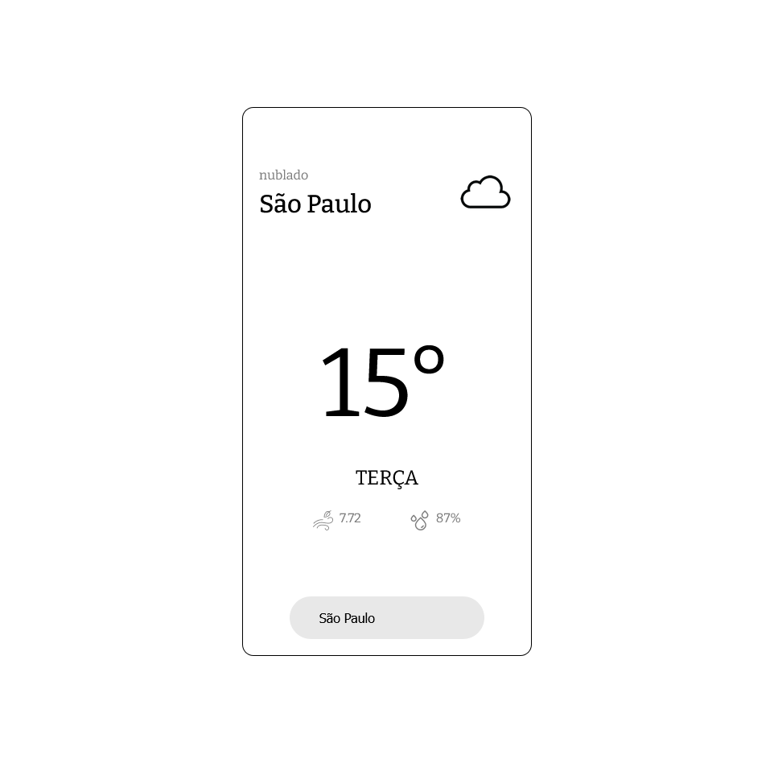
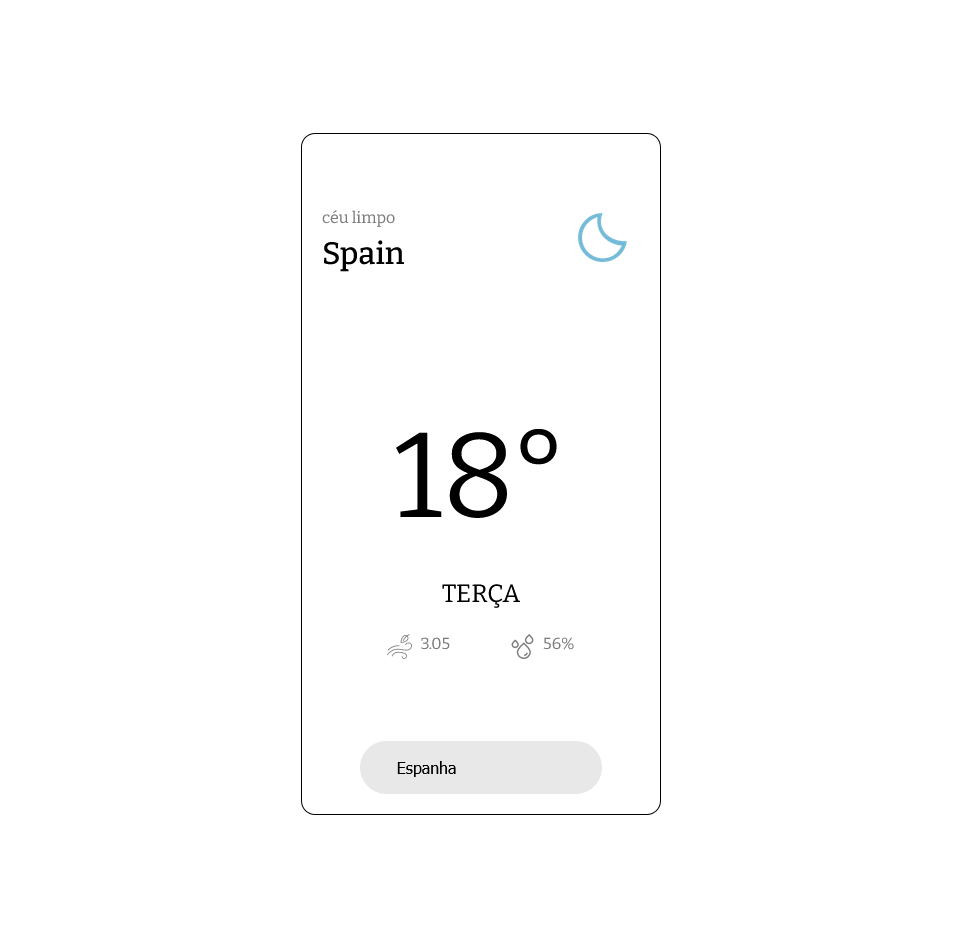
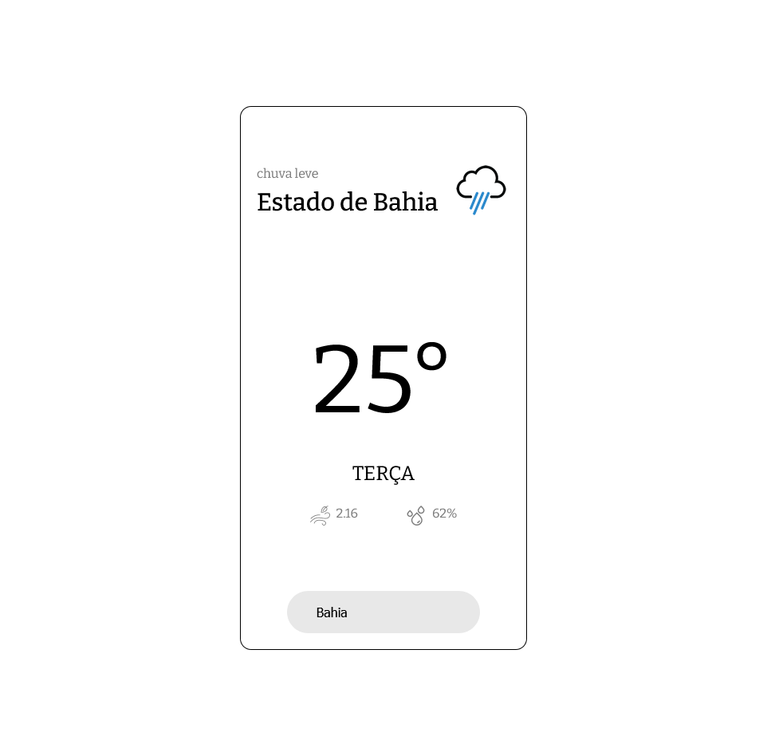

# Weather-App

WebApp de previsões climáticas em tempo real.

 
  
## Demonstração da aplicação

 
<a href="https://guilhermewilker.github.io/Weather-App/" target="_blank">🔗Clique aqui e use agora mesmo!</a>

## Roadmap

- 🖥️Display de dados climáticos desde a temperatura,  
  humidade, sensação térmica e entre outros..

## Funcionalidades

- 🕢Data em tempo real.
- 🖥️Design responsivo.
- 📃Previões climáticas.

## Tecnologias utilizadas

## Social medias 🖥️

